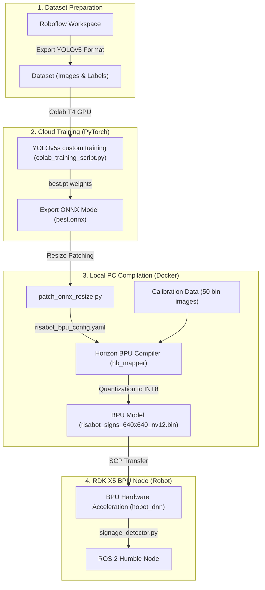

# RISA-Bot Architecture

Competition-mode autonomous vehicle built on ROS 2 Humble.

## Node / Topic Graph

```mermaid
graph TD
    subgraph Sensors
        CAM["Astra Mini Camera"]
        LIDAR["YDLiDAR Tmini Plus"]
        JOY["Joy Node"]
    end

    subgraph Perception
        LF["line_follower_camera"]
        OA_LID["obstacle_avoidance"]
        OA_CAM["obstacle_avoidance_camera"]
        TL["traffic_light_detector"]
        BG["boom_gate_detector"]
        TUN["tunnel_wall_follower"]
        OBS["obstruction_avoidance"]
        PARK["parking_controller"]
        SIG["signage_detector (YOLO)"]
    end

    subgraph Control
        AD["auto_driver"]
        CSC["cmd_safety_controller"]
        SC["servo_controller"]
        HM["health_monitor"]
    end

    subgraph Interface
        DASH["dashboard (port 8080)"]
    end

    CAM -->|"/camera/color/image_raw"| LF
    CAM -->|"/camera/color/image_raw"| OA_CAM
    CAM -->|"/camera/color/image_raw"| TL
    CAM -->|"/camera/color/image_raw"| SIG
    CAM -->|"/camera/color/image_raw"| DASH

    LIDAR -->|"/scan"| OA_LID
    LIDAR -->|"/scan"| BG
    LIDAR -->|"/scan"| TUN
    LIDAR -->|"/scan"| OBS
    LIDAR -->|"/scan"| DASH

    LF -->|"/lane_error + /lane_lost"| AD
    LF -->|"/camera/debug/line_follower"| DASH
    
    OA_LID -->|"/obstacle_front"| AD
    OA_LID -->|"/obstacle_front"| DASH
    
    OA_CAM -->|"/obstacle_detected_camera"| AD
    OA_CAM -->|"/obstacle_detected_camera + /camera/debug/obstacle"| DASH
    
    TL -->|"/traffic_light_state"| AD
    TL -->|"/traffic_light_state + /camera/debug/traffic_light"| DASH
    
    BG -->|"/boom_gate_open"| AD
    BG -->|"/boom_gate_open"| DASH
    
    TUN -->|"/tunnel_detected + /tunnel_cmd_vel"| AD
    TUN -->|"/tunnel_detected"| DASH
    
    OBS -->|"/obstruction_active + /obstruction_cmd_vel"| AD
    OBS -->|"/obstruction_active"| DASH
    
    PARK -->|"/parking_cmd_vel + /parking_complete + /parking_status"| AD
    PARK -->|"/parking_complete"| DASH
    
    SIG -->|"/parking_signboard_detected + /hill_sign_detected + /traffic_light_state"| AD
    SIG -->|"/parking_signboard_detected + /traffic_light_state + /camera/debug/signage"| DASH

    AD -->|"/cmd_vel_auto_raw"| CSC
    AD -->|"/parking_command"| PARK
    AD -->|"/obstacle_detected_fused"| DASH
    AD -->|"/dashboard_state"| DASH
    AD -->|"/loop_stats"| DASH
    AD -->|"/record_playback_cmd"| SC
    
    CSC -->|"/cmd_vel_auto"| SC
    CSC -->|"/cmd_safety_status + /loop_stats"| DASH
    
    JOY -->|"/joy"| SC
    JOY -->|"/joy"| DASH
    
    SC -->|"Rosmaster_Lib (serial)"| HW["Motor Board"]
    SC -->|"/cmd_vel"| DASH
    SC -->|"/auto_mode"| AD
    SC -->|"/auto_mode"| DASH
    SC -->|"/set_challenge"| AD
    SC -->|"/set_challenge"| DASH
    SC -->|"/odom"| DASH
    SC -->|"/odom"| AD
    SC -->|"/odom"| PARK
    SC -->|"/imu/pitch + /record_playback_state + /loop_stats"| AD
    SC -->|"/record_playback_state"| DASH
    SC -->|"/dashboard_ctrl"| DASH
    SC -->|"/loop_stats"| DASH
    
    DASH -->|"/record_playback_cmd"| SC
    
    HM -->|"/health_status"| DASH
```



## AI / BPU Model Architecture

The `signage_detector` node leverages a custom-trained **YOLOv5s** model running hardware-accelerated inference on the RDK X5 BPU (using `hobot_dnn` / `pyeasy_dnn`).

### 1. Offline Compilation & Deployment Flow
This graph shows the lifecycle of the AI model from dataset labeling to robot compilation and deployment:



### 2. Real-Time Inference Pipeline
This graph details how image frames from the camera are processed in real-time on the robot's hardware:

```mermaid
graph TD
    CAM["Astra Mini Camera"] -->|"/camera/color/image_raw (BGR)"| Sub["1. Subscriber Callback"]
    Sub -->|OpenCV BGR| Pre["2. Preprocessing"]
    
    subgraph Preprocessing ["Perception Preprocessing"]
        Pre --> Resize["Resize to 640x640"]
        Resize --> YUV["Convert to YUV I420"]
        YUV --> Interleave["Interleave UV Planar Components"]
        Interleave --> NV12["Construct BPU-Native NV12 Layout"]
    end

    NV12 -->|Zero-Copy Input| BPU_Forward["3. BPU Forward Pass (pyeasy_dnn.forward)"]
    BPU_Forward -->|Raw Output Tensor (1, 25200, 11)| Post["4. Postprocessing (CPU)"]

    subgraph Postprocessing ["Perception Postprocessing"]
        Post --> Squeeze["Squeeze Output to 2D (25200, 11)"]
        Squeeze --> Filter["Confidence Filtering (Threshold = 0.10)"]
        Filter --> NMS["Vectorized NMS (IoU Threshold = 0.45)"]
        NMS --> Latch["Consecutive Frames Gating (Hysteresis)"]
    end

    Latch -->|Detections| Pubs["5. State Publishers"]

    subgraph Output ["ROS 2 Topics"]
        Pubs -->|"/parking_signboard_detected (Bool)"| AD_Park["auto_driver (Brain)"]
        Pubs -->|"/hill_sign_detected (Bool)"| AD_Hill["auto_driver (Brain)"]
        Pubs -->|"/traffic_light_state (String)"| AD_TL["auto_driver (Brain)"]
        Pubs -->|"/camera/debug/signage (Image)"| DASH["dashboard (Web UI)"]
    end
```

## State Machine (auto_driver)

| Priority | State            | Trigger                                         | Action                                        |
| -------- | ---------------- | ----------------------------------------------- | --------------------------------------------- |
| 1        | MANUAL           | `auto_mode=false`                               | No cmd_vel published                          |
| 2        | FINISHED         | Lap 2 + perpendicular park done                 | Full stop                                     |
| 3        | EMERGENCY_STOP   | `/cmd_safety_status` estop active               | Full stop                                     |
| 4        | OBSTRUCTION      | LiDAR lateral avoid active                      | Use `/obstruction_cmd_vel`                    |
| 4.5      | REVERSE_ADJUST   | Too close to front obstacle                     | Reverse slowly                                |
| 5        | ROUNDABOUT       | Lap 1 + after obstruction clears                | Lane follow for `t_roundabout_sec`            |
| 6        | PARKING_IDLE     | Lap 2 + signboard detected                     | Full stop for `parking_idle_duration`         |
| 6.5      | PARKING_PLAYBACK | Parking idle complete                          | Trigger preset movement playback              |
| 7        | TUNNEL           | Walls on both sides detected                    | Use `/tunnel_cmd_vel`                         |
| 8        | BOOM_GATE        | Gate closed (armed after roundabout)            | Full stop (disabled/commented out for test)   |
| 9        | TRAFFIC_LIGHT    | Red/yellow detected (armed after tunnel)       | Full stop (disabled/commented out for test)   |
| 9.5      | HILL             | IMU pitch exceeds threshold                     | Drive up slowly, scaled steering              |
| 10       | LANE_RECOVERY    | Lane lost                                       | Stop in place                                 |
| 11       | LANE_FOLLOW      | Default                                         | Steering from `/lane_error`                   |

## Competition Flow

```
Lap 1: START → Lane Follow → Obstruction → Roundabout →
        BoomGate1 → Tunnel → BoomGate2 →
        Hill → Bumper → TrafficLight → START

Lap 2: Lane Follow → Obstruction → Roundabout →
        Parallel Park → Drive → Perpendicular Park → FINISH
```

## Key Files

| File                        | Purpose                                 |
| --------------------------- | --------------------------------------- |
| `auto_driver.py`            | Central state machine (brain)           |
| `servo_controller.py`       | Hardware interface to Rosmaster board   |
| `dashboard.py`              | Web dashboard server                    |
| `dashboard_templates.py`    | HTML/CSS/JS for dashboard UI            |
| `line_follower_camera.py`   | Lane detection via camera               |
| `traffic_light_detector.py` | R/Y/G circle detection                  |
| `obstruction_avoidance.py`  | LiDAR lateral steering around obstacles |
| `tunnel_wall_follower.py`   | PD wall following in tunnel             |
| `boom_gate_detector.py`     | LiDAR gate barrier detection            |
| `parking_controller.py`     | Odometry-based parking maneuvers        |
| `signage_detector.py`       | YOLO-based signage detection (parking)  |
| `cmd_safety_controller.py`  | Safety limits and e-stop enforcement    |
| `health_monitor.py`         | Topic freshness and runtime health      |
| `config/params.yaml`        | Centralized tunable parameters          |
| `verify_live.py`            | Live diagnostic tool for YOLO BPU verification |
