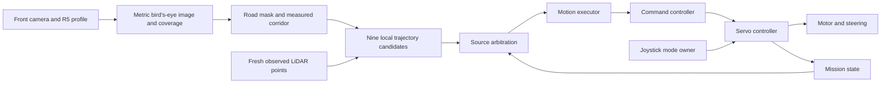

# Risabot 5 autonomy connection audit

Audited 2026-09-22, approximately 21:00-21:20 Malaysia time. This is a source and offline behavior audit, with read-only board inspection. It is not a physical driving sign-off.

**Follow-up at 21:29 Malaysia time:** F01's pending deployment is now complete. The two affected packages rebuilt and the four installed files match the reviewed local hashes. The stack is running in MANUAL, with zero autonomous commands observed during an eight-second capture; physical driving remains untested. See `scratch/risabot5_control_audit/lane_bias_deployment.json` and `lane_bias_manual.json`. The audit-time snapshot below is retained as history.

## Result

The front-camera lane-test chain is implemented and connected through to the hardware bridge. **The complete 16-block V4 autonomous mission is not yet connected in this checkout.** Passing component tests does not close the mission, localization, path-tracking or dashboard workflow gaps below.

Source: `NXGV-Driveless-Carbot-Challenge`, branch `feat/safety-contract-rework`, HEAD `171dd8ed3e95a174f87081d73f39be8262815ff0`, plus the current uncommitted working tree. The separate V2 checkout is a design/reference source only for this audit. Its simulator architecture guide explicitly says the 16 blocks are software jobs, not proof of existing ROS nodes.

- Local regression command: `python -m pytest -q tests src/risabot_v4_experimental/test src/risabot_v4_control/test`.
- Result: **316 passed, 1 skipped, 32.78 s**. Hardware and ROS transport are inert in the node integration tests; the skipped test concerns unavailable symlink creation.
- Static inventory: 117 Python files parsed across the four application packages, with interface call sites and file hashes saved. Static expressions are not a resolved live ROS graph.
- At 13:09:36 UTC, read-only SSH reached `sunrise@192.168.137.74`, hostname `risabot5`. No matching car-control process was listed, apart from the inspection shell itself.
- The board's R5 camera profile still hashes to `fe599255c1ebdb6c03e50f216f534db1a7e29e7795bad179d38d4fe771326a99`.
- The four latest lane-bias/road-memory files differ between local source and board source. Their deployment and installed-copy verification remain open.
- No control code, active configuration, board process or motor command was changed during this audit. The dashboard task is independently editing its owned local files, so the test result describes this audit snapshot.

## The connected lane-test path

| Connection | Contract and evidence |
| --- | --- |
| Camera to BEV | `/camera/color/image_raw` -> `bev_shadow`; explicitly selected R5 profile, native 320x240, rear-axle ground origin. `track_test.launch.py` configures the camera from that profile. |
| BEV to road | `/v4_experimental/bev/primary/image` and `/coverage` -> `road_mask_shadow`; synchronized image/coverage, dark-road segmentation, connected component and metric corridor. |
| Road to planner | `/v4_experimental/road/status` and `/road/primary/fused` -> `trajectory_shadow`; timestamp agreement, visible boundaries, nine bicycle-model candidates and observed obstacles. |
| Planner to arbitration | `/v4_experimental/trajectory/status` -> `arbitration_shadow`, together with `/dashboard_state` and `/motion_permitted`. |
| Arbitration to executor | `/v4_experimental/arbitration/proposed_request` -> `motion_executor`; JSON source/action/reference validation. |
| Executor to command controller | `/cmd_vel_v4_raw`; V4 explicitly selected. A stale V4 request does not fall back to legacy commands. |
| Command controller to actuator | `/cmd_vel_auto` -> `servo_controller`; this is the application hardware writer. Its MANUAL/AUTO state and joystick watchdog remain authoritative. |
| Units and signs | Road coordinates: metres, forward +x, left +y; path yaw/curvature left-positive. Car command `angular.z` is normalized steering, **positive RIGHT**, not ROS yaw rate. The conversion changes sign once. `linear.x` is a legacy request unit with an uncalibrated physical-speed map. |
| Requested duty | Test executor uses `65 / 255`; bridge multiplies by 255 and caps the Rosmaster's -100..100 motor scale at 65. This is **65% duty**, not measured 0.65 m/s. Servo center 80 is owner-measured; wheel-angle limits remain estimates. |
| Modes | Lane-test startup is MANUAL. It accepts LANE_FOLLOW only; it deliberately omits mission detectors, parking and reverse recovery. |

`tests/test_track_test_pipeline.py` exercises the real node classes from lane proposal through arbitration, executor, command controller and inert hardware bridge. Separate road/planner tests and actual-image replay cover the clipped-boundary correction. These do not prove physical steering sign, linkage travel, grip or speed.

## Comparison with all 16 V4 design blocks

Reference: separate V2 checkout `docs/reference/Carbot_Architecture_V4.md`; that document describes the simulator, not this deployed ROS stack.

| Block | Present implementation | Connection / missing work |
| --- | --- | --- |
| 01 Map, start, goals | Dashboard map/mission planning helpers, recording utilities | Export utilities exist; no runtime consumer/activation contract for their map/mission v2 files. |
| 02 Sensors | Astra, side-camera relay/manager, LiDAR, Rosmaster encoders/IMU, joystick; separate raw UWB feed | R5 front calibration is present. Side coverage, geometry, odometry and UWB alignment need measurements. |
| 03 Road from camera views | BEV, coverage, dark-road segmentation, connected road | Front is wired. V4 physical adaptation has primary/secondary profiles, not the simulator's complete three-camera fusion. |
| 04 Recent road memory | `local_road_memory.py` | Implemented and tested; intentionally disabled in the R5 lane test pending odometry calibration. |
| 05 Smooth local pose | `pose_shadow.py` mirrors `/odom`; separate `heading_fusion.py` emits `/odom_fused` | No camera-edge-to-map correction in this V4 pose node. Default V4 pose/memory/executor inputs use raw odometry; selecting a consistent calibrated source is unfinished. |
| 06 Coarse UWB pose | Raw-range bridge, innovation-gated coarse offset estimator | Pure estimator implemented; measurements/gates unvalidated. ROS pose adapter has a reproduced yaw/frame defect. Output currently serves diagnostics, not route selection. |
| 07 Global route | Simulator/reference search and offline map/mission helpers | No current driving node loads and follows the exported global mission. |
| 08 Mission logic | Reactive challenge FSM, red/green/gate holds, tunnel/obstruction handoff, parking playback | Wired for legacy challenge semantics, not the simulator's entire map-based ROAD/PARKING/RECOVERY mission. |
| 09 Route-conditioned corridor | Metric corridor; legacy lane node separately handles route requests | V4 planner does not consume the selected route/branch. Branch confirmation and V4 motion can disagree. |
| 10 Local trajectory | Nine candidates, lookahead steering, lag/rate bicycle rollout, footprint/obstacle checks | Wired for lane following. Road thresholds, physical geometry, actuator response and timing need track validation. |
| 11 Parking planner | Marking-derived goal and analytic Reeds-Shepp proposals | Implemented, but normal mission starts recorded playback instead of selecting V4 parking states; rear calibration/goals also incomplete. |
| 12 Recovery planner | Bounded reverse/rejoin proposals and request policy | Interfaces exist; rear coverage and execution tests absent. Attempt count measures exhausted-planning episodes, not acknowledged maneuver executions. |
| 13 Path to motion | Lane steer conversion; parking/recovery path curvature feed-forward | Lane conversion wired. Path execution needs lateral/heading feedback, verified gear-change stops, endpoint heading and execution-result contracts. |
| 14 Motion constraints | Source/observation freshness, permit, explicit stops, obstacle checks | Offline stop/source tests pass. Lane test has explicit commissioning overrides; full-mission physical tests remain. |
| 15 One command owner | `cmd_safety_controller` selects autonomous source; `servo_controller` writes hardware | Wired locally; one-publisher/one-process check still needed on the next running stack. UI mode requests must be handled by the actual owner. |
| 16 Vehicle feedback | Hardware writes, encoder odometry, IMU reports | R5 trim measured. Steering response, forward odometry sign, duty-to-speed and complete repeated laps unproven. |

## Concrete findings and required corrections

### F01 — Latest left-bias correction is not deployed

Read-only SHA-256 comparison confirms board source differs for `track_test_config.py`, `road_mask_core.py`, `road_mask_shadow.py` and `trajectory_shadow.py`. Local code rejects camera-clipped rows as steering-center measurements and disables unverified odometry memory in this test. Deploy those files, rebuild their packages and verify installed hashes before using another run to judge the correction. TODO A01-A03.

### F02 — Full competition launch does not select the R5 profile consistently

`v4_competition.launch.py` includes stage launches that hardcode `config/camera_profiles.yaml`, containing the earlier car's ground correspondences. It does not forward the lane-test `vehicle/profile_path` selection. The base `params.yaml` has R5 trim 80 but retains a 1.3 right-steer boost; the R5 test overrides that to 1.0. The full launch therefore does not reproduce the validated test configuration. Add a consistent per-car configuration through every stage. TODO D01.

### F03 — Mission branch choice does not guide V4 steering

`mission_logic.py:59` and `:148` select and publish `/lane_route`. `line_follower_camera.py` consumes it and publishes `/lane_route_confirmed`. `trajectory_shadow.py:142` subscribes only to road status, road mask and scan. Stage 8 uses V4 trajectory steering in ROUNDABOUT, so legacy branch confirmation does not establish that the actual V4-selected path follows that branch. Feed the mission route into V4 corridor/path selection and confirm the branch from the path actually executed. TODO D03-D05.

### F04 — Normal mission never selects V4 parking execution

`mission_logic.py:185` sends `playback:<kind>` and enters PARKING_PLAYBACK. Stage 8 expects PARALLEL_PARK/PERPENDICULAR_PARK for a V4 parking path; it stops in PARKING_PLAYBACK while the command controller separately selects recorded playback. Defining those enum values is not an autonomous transition. Parking goal source also caches a startup `parking_kind`, default parallel. Add mission-driven kind/goal selection, maneuver identity, started/completed/failed/cancelled feedback and transitions. TODO D06.

### F05 — Parking/recovery tracker cannot correct off-path pose

`control_core.py:111` discards pose yaw, chooses a nearby path index and commands that point's stored curvature. Offline probes on a straight path produce steering zero at both +/-5 cm lateral error and +/-0.35 rad heading error. At the endpoint it reports complete even with a 1 rad heading error. This is a specific missing feedback behavior, separate from the camera-based lane steering correction. Add forward/reverse tracking feedback, cusp handling and positional/heading completion checks. TODO D07-D08.

### F06 — Coarse pose position and orientation are published in inconsistent frames

`pose_shadow.py:160` copies the input orientation but transforms the coarse position. In the inert-node reproduction with a 90-degree configured frame rotation, expected yaw is 1.7708 rad but published yaw remains 0.2 rad. The same function aliases the input header and mutates its frame ID to `v4_coarse_global`. Copy headers, publish the transformed orientation, and audit covariance/frame treatment. Test message outputs, not only the pure estimator. TODO C03/C05.

### F07 — Several full-simulator concepts are not ported into the active motion path

Map/mission v2 activation, global route tracking, visual correction of local pose, and route-conditioned V4 corridor guidance are absent. `heading_fusion` exists separately but this does not mean V4 automatically uses `/odom_fused`. UWB coarse pose reaches telemetry, not global route selection. The architecture matrix above records these distinctions. TODO C03-C05 and D02-D05.

### F08 — Recovery completion/attempt accounting is not tied to actual execution

`recovery_request_source.py` increments attempts when an exhausted-candidate episode clears; it has no maneuver execution-result subscription. Stage 8 records `path complete` internally/status but no mission result handshake connects completion to this counter. Test interrupted, failed and repeated recoveries; count acknowledged attempts with explicit reset policy. TODO D09.

### F09 — Dashboard mockup workflows need real backend adapters

The active backend has no calibrate/race launch pair, process supervisor, race-start service, 13-step calibration-session runner or map/mission activation API. Existing `/api/reset_odom` resets display counters only. Existing command-forwarding responses do not prove hardware completion. `/auto_mode` is published by the servo owner and is not an authoritative mode-command API. See `DASHBOARD_V4_HANDOFF.md`. TODO E01-E05.

### F10 — Historical documentation must not be treated as current R5 evidence

`TRACK_AUTONOMY_TODO.md` contains a 2026-09-21 car-1 session, servo center 110, older IP and temporary launch instructions. Some package README descriptions also predate later goal/request source nodes. The new R5 TODO is the current plan; old logs remain historical evidence. A documentation claim or simulator result is not a current hardware PASS.

## Evidence and limits

Evidence directory: `scratch/autonomy_readiness_20260922/`.

- `source_inventory_and_probes.json`: Python source hashes/interfaces, normal mission return-state inventory, path-control reproductions.
- `pose_output_probe.json`: real pose-adapter output with inert ROS.
- `board_read_only.json`: timestamped SSH process/profile/source snapshot.
- `deployment_comparison.json`: four pending-file hash differences.
- `collect_audit.py`, `probe_pose_output.py`: reproducible collection/probes. Collection performs read-only SSH; neither starts a stack.
- Earlier real-image comparison: `scratch/risabot5_control_audit/track_centered/replay_before.json` and `replay_after.json`.
- Front calibration evidence: `RISABOT5_CALIBRATION.md` and `calibration_risabot5/front_session/`.

This audit verifies core source contracts and selected failure reproductions. Live ROS QoS, publishers, actual timing, steering mechanics, full-course perception and repeated mission completion remain explicit tests in `RISABOT5_AUTONOMY_TODO.md`.
