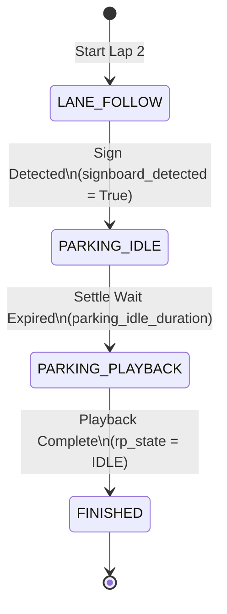

# Module 6: Autonomous Parking via Recorded Movements

## Learning Objectives

By the end of this module, you will:
- Understand the concept of **Record and Playback** for executing repeatable, complex maneuvers (like parking)
- Learn how to record joystick driving commands and save them to a persistent file
- See how the BPU-accelerated **Signage Detector** integrates with the central brain to trigger parking
- Understand the **State Machine transitions** of the `auto_driver` node during the parking sequence
- Perform hands-on testing to record, tune, and execute an autonomous parking run on Lap 2

---

## 1. The Challenge: Precision Parking

Autonomous parking is one of the trickiest challenges for a mobile robot. If you rely purely on reactive sensors (like LiDAR or cameras), minor variations in lighting, surface texture, or obstacle angles can make your code fail on competition day.

A highly reliable alternative is **Record & Playback** (open-loop trajectory execution):
1. **Record**: A human driver carefully maneuvers the robot into the parking slot. The system records the motor speeds and steering angles at a high frequency (20 Hz).
2. **Save**: The sequence is saved persistently to the robot's disk.
3. **Trigger**: When the robot's camera detects the **Parking Signboard**, it stops, waits for the inertia to settle, and plays back the recorded sequence with sub-second precision.

---

## 2. System Architecture

The parking system utilizes three key components:
1. **`signage_detector` (Perception)**: Analyzes camera frames using the BPU. When a parking signboard is seen, it publishes `True` to `/parking_signboard_detected`.
2. **`auto_driver` (Decision Maker)**: Receives the detection on Lap 2, stops the robot, waits, and publishes the `playback` command to `/record_playback_cmd`.
3. **`servo_controller` (Hardware Interface & Replayer)**: Manages the recording buffer, saves it to `~/recorded_movement.json`, and plays it back to the Rosmaster board.

```text
       [ CAMERA ]
           │
           ▼ (image_raw)
   ┌────────────────┐
   │signage_detector│
   └───────┬────────┘
           │
           ▼ (/parking_signboard_detected = True)
   ┌─────────────┐
   │ auto_driver │
   └──────┬──────┘
          │
          ▼ (/record_playback_cmd = "playback")
   ┌──────────────────┐
   │ servo_controller │ ◄── [ ~/recorded_movement.json ]
   └──────┬───────────┘
          │
          ▼ (PWM + steering angle)
     [ MOTOR BOARD ]
```

---

## 3. The Record & Playback Interface

The `servo_controller` node listens to the `/record_playback_cmd` topic (as a `std_msgs/String`) and accepts the following commands:

| Command | Action | Controller Shortcut | Description |
|---|---|---|---|
| `record` | Start recording | **Button A** | Clears the current buffer and records incoming motor commands at 20 Hz |
| `stop` | Stop recording/playback | **Button A** (Record) / **Button X** (Playback) | Returns the recorder to the `IDLE` state |
| `playback` | Play back recording | **Button X** | Replays the recorded buffer step-by-step |
| `save` | Save to disk | **Button B** | Persists the recording to `~/recorded_movement.json` |

---

## 4. The Trigger State Machine

When running in **AUTO** mode on **Lap 2**, the `auto_driver` coordinates the parking trigger:



1. **`LANE_FOLLOW`**: The robot follows the line normally.
2. **`PARKING_IDLE`**: The robot halts (`cmd_vel` linear and angular set to `0`). It dwells in this state for `parking_idle_duration` (default: `2.0` seconds) so the robot comes to a complete standstill, preventing drift during playback.
3. **`PARKING_PLAYBACK`**: The brain publishes `playback` to `/record_playback_cmd`. While replaying, the brain commands `0` velocity so it does not fight the replayer.
4. **`FINISHED`**: The brain waits until the `servo_controller` reports its state has returned to `IDLE` (indicating playback is complete). The robot halts and enters the finished state.

---

## 5. Hands-On Exercises

Let's set up and execute a custom parking maneuver.

### Step 1: Record Your Parking Trajectory

1. Ensure the robot and controllers are running:
   ```bash
   ros2 launch risabot_automode bringup.launch.py
   ```
2. Place the robot at the starting position (e.g. aligned next to the parking slot).
3. **Start Recording**: Press **Button A** on the gamepad, or run the following command in a terminal:
   ```bash
   ros2 topic pub --once /record_playback_cmd std_msgs/String "{data: 'record'}"
   ```
   *Verify*: The terminal will print `🔴 RECORDING started`.
4. Carefully drive the robot into the parking slot using the joystick. Keep your movements smooth and precise!
5. **Stop Recording**: Press **Button A** again (or publish `stop`):
   ```bash
   ros2 topic pub --once /record_playback_cmd std_msgs/String "{data: 'stop'}"
   ```
   *Verify*: The terminal will print `⏹ RECORDING stopped`.
6. **Save to Disk**: Press **Button B** (or publish `save`):
   ```bash
   ros2 topic pub --once /record_playback_cmd std_msgs/String "{data: 'save'}"
   ```
   *Verify*: The terminal will print `Saved X movement samples to ~/recorded_movement.json`.

> [!TIP]
> You can inspect your recorded trajectory file on the robot by reading the JSON file:
> `cat ~/recorded_movement.json`
> It contains a list of motor PWM and steering servo angles.

---

### Step 2: Test the Playback

Before running it autonomously, verify that the recorded path is accurate.
1. Place the robot back at the exact starting position.
2. Ensure you are in **MANUAL** mode.
3. **Start Playback**: Press **Button X** on the gamepad, or run:
   ```bash
   ros2 topic pub --once /record_playback_cmd std_msgs/String "{data: 'playback'}"
   ```
4. Watch the robot recreate the maneuvers. If it hits an obstacle or drifts off-course, press **Button X** (or publish `stop`) to abort immediately.

---

### Step 3: Run the Autonomous Trigger

Now, let's tie the recorded movement to the BPU camera trigger.
1. Position the robot a few feet before the parking slot, aligned on the lane.
2. Put a **Parking Signboard** in front of the parking slot so the camera can see it when it drives up.
3. Configure the robot to think it is on **Lap 2**:
   ```bash
   ros2 param set /auto_driver current_lap 2
   ```
4. Put the robot into **AUTO** mode by pressing the **Start** button on the gamepad, or run:
   ```bash
   ros2 topic pub --once /auto_mode std_msgs/Bool "{data: true}"
   ```
5. The robot will drive forward. As soon as the camera sees the parking sign:
   - It will halt (`PARKING_IDLE` state).
   - After 2 seconds, it will publish `playback` and start reversing/maneuvering into the slot.
   - Once the playback sequence completes, the robot will stop and the terminal will output `COMPETITION FINISHED`.

---

## 6. Advanced Tuning

### Tuning the Settling Time
If the robot triggers playback while it is still sliding forward from its lane-following speed, it will drift. You can adjust the standstill duration:
```bash
# Set idle duration to 1.5 seconds
ros2 param set /auto_driver parking_idle_duration 1.5
```

### Tuning Detection Size
You can prevent premature triggers by requiring the parking sign to reach a minimum width (in pixels) in the camera frame before acting on it:
```bash
# Require the sign bounding box to be at least 80 pixels wide
ros2 param set /signage_detector min_parking_sign_width 80
```

---

## 7. Troubleshooting

| Symptom | Likely Cause | Fix |
|---|---|---|
| **Robot drifts/undercuts on playback** | Low battery voltage or wheel slip | Charge the battery! Recorded open-loop movements are highly sensitive to battery level. Keep the battery topped off for consistent trials. |
| **Trigger doesn't fire** | Signage detector is not active, or confidence is too high | Echo `/parking_signboard_detected`. If it stays `false`, reduce the confidence threshold: `ros2 param set /signage_detector conf_threshold 0.35` |
| **Playback starts while robot is moving** | `parking_idle_duration` is too low | Increase the duration to `2.5` or `3.0` seconds to let the robot fully settle. |
| **No recording loaded on reboot** | Recording wasn't saved | You must press **Button B** (or publish `save`) to write `~/recorded_movement.json` to disk, otherwise the buffer is lost when the node restarts. |

**Previous:** [Module 5 — Tunnel Navigation](05-tunnel-navigation.md)
**Next:** [Module 7 — Computer Vision & Hardware-Accelerated AI (BPU)](07-computer-vision.md)

